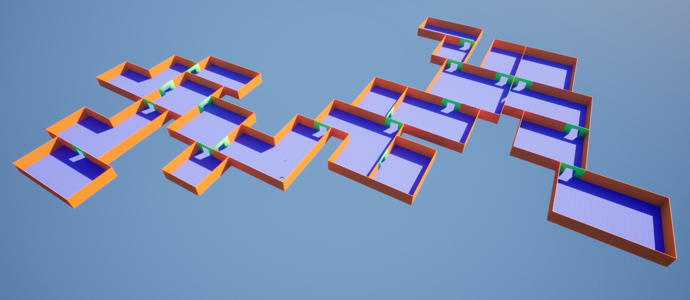
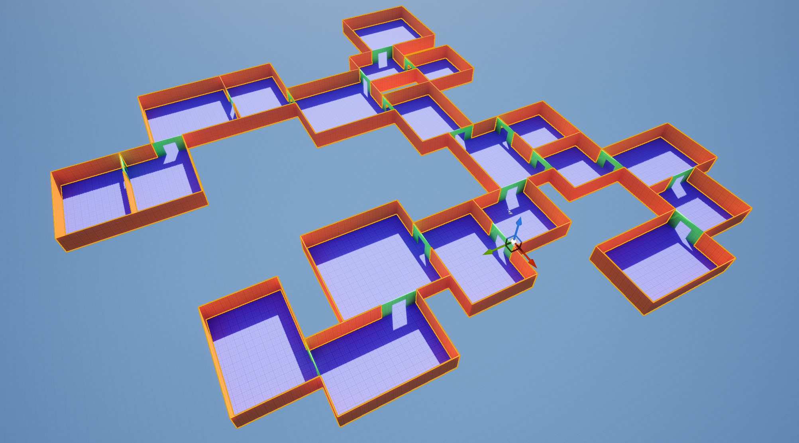
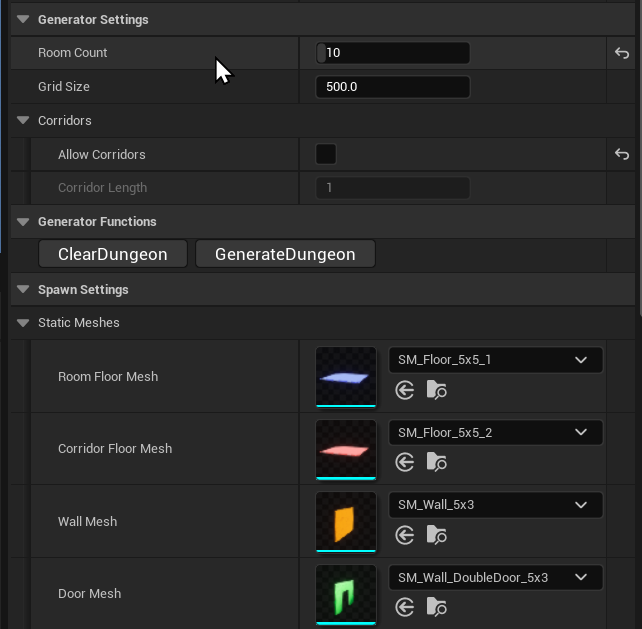
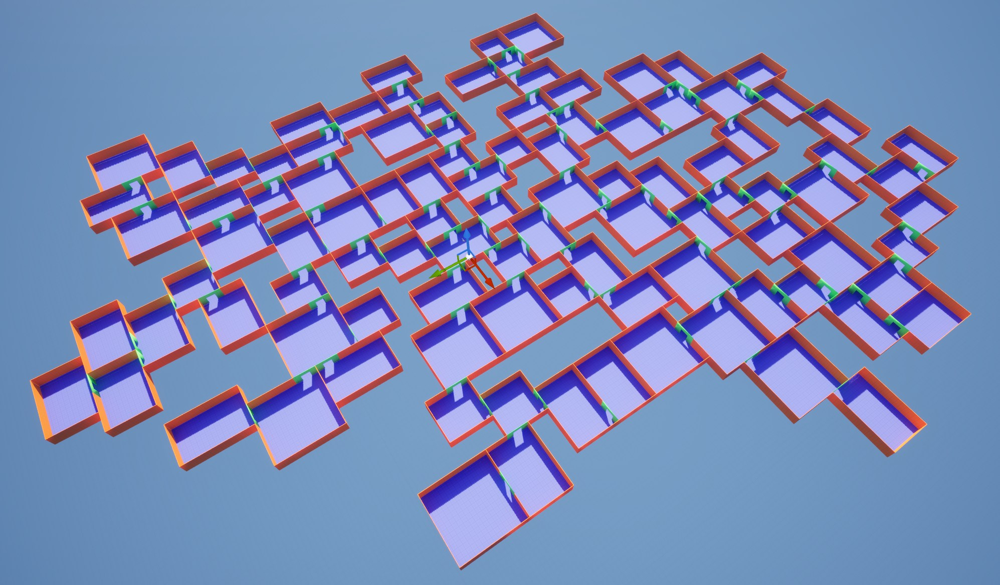
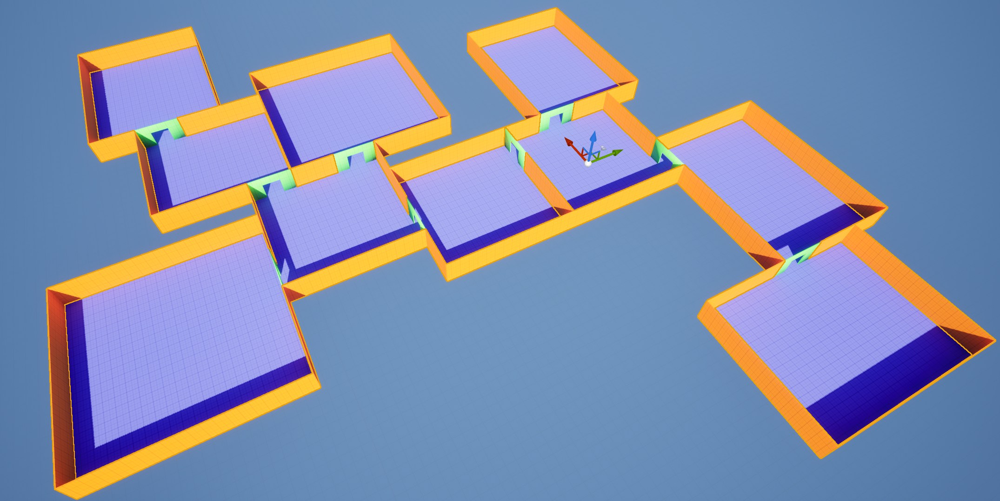

# Dungeon Forge

Dungeon forge is a plugin for Unreal Engine 5 which allows designers to create randomly generated dungeons for a game. Levels can be generated at designtime for bespoke dungeons, or at runtime for procedutally generated dungeons during gameplay.

